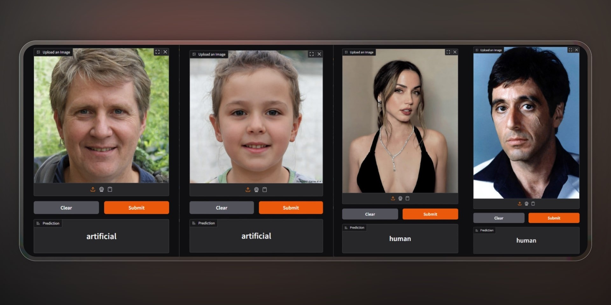

# 🛡️ SDXL-Deepfake-Detector

### Detecting AI-Generated Faces with Precision and Purpose

> *Not just another classifier — a tool for digital truth.*

A lightweight, open-source deep learning model to classify human faces as **real (human)** or **AI-generated (deepfake)** using a fine-tuned Vision Transformer. Developed for privacy, accuracy, and ethical AI.

🔧 **Developed by:** [Sadra Milani Moghaddam](https://sadramilani.ir)  
🧠 **Model:** `SADRACODING/SDXL-Deepfake-Detector` on [Hugging Face](https://huggingface.co/SADRACODING/SDXL-Deepfake-Detector)  
📁 **Code & Repo:** [GitHub Repository](https://github.com/SadraCoding/SDXL-Deepfake-Detector)  
📄 **License:** [MIT](LICENSE) — Free for research and commercial use



---

## 🔍 Why This Matters

As generative AI (like SDXL, DALL·E, and Midjourney) becomes more accessible, synthetic media threatens digital authenticity — especially for vulnerable communities. 

This project began as a technical experiment but evolved into a **privacy-aware, open-source defense** against visual misinformation, prioritizing **ethical deployment**, **transparency**, and **offline-first design**.

---

## 🧩 Model Overview

**SDXL-Deepfake-Detector** is a fine-tuned Vision Transformer (ViT) that classifies face images as:

- `0` → `"artificial"` (AI-generated / Deepfake)
- `1` → `"human"` (authentic human face)

It was created by fine-tuning [`Organika/sdxl-detector`](https://huggingface.co/Organika/sdxl-detector) on the [140k Real and Fake Faces dataset](https://www.kaggle.com/datasets/xhlulu/140k-real-and-fake-faces).

### ✅ Key Features

- **High Accuracy**: **86%** test accuracy on balanced real/fake data.
- **Efficient Training**: Trained on a single **RTX 3060 (12GB VRAM)** — no need for large-scale infrastructure.
- **Offline Inference**: Runs entirely locally — your images never leave your device.
- **Lightweight & Modular**: Easy to integrate, extend, or fine-tune further.
- **Open Source & Ethical**: MIT licensed, transparent, and built with privacy in mind.

---

## ⚙️ Training Approach

| Component | Description |
|--------|-------------|
| **Base Model** | `Organika/sdxl-detector` (ViT pre-trained on SDXL artifacts) |
| **Dataset** | [xhlulu/140k-real-and-fake-faces](https://www.kaggle.com/datasets/xhlulu/140k-real-and-fake-faces) – 140K balanced real/AI face images |
| **Method** | Fine-tuning with Hugging Face `transformers` |
| **Hardware** | Single NVIDIA RTX 3060 (12GB) |

By leveraging prior knowledge of diffusion-based artifacts and generalizing across diverse fake/real samples, this model achieves strong performance without massive compute.

---

## 🚀 Quick Start

### 1. Install Dependencies

```bash
pip install -r requirements.txt
```
### 2. Run the model

```bash
python model/predict.py --image ./example.jpg #Replace it with your image directory
```

## How to train model

```bash
python model/train.py
```
